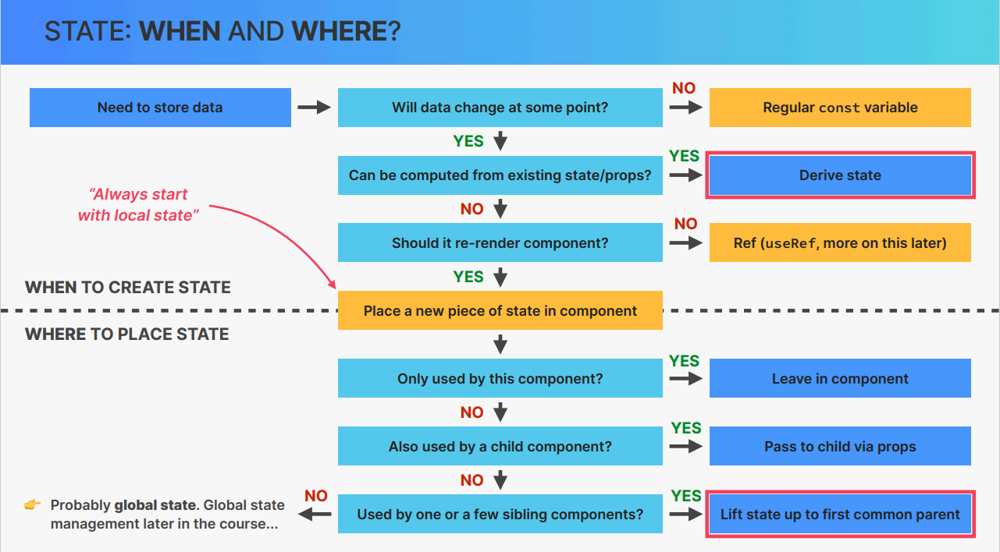

## What is React? 🔥

React is a JavaScript library for building user interfaces and it is all about components.

### IMPERATIVE VS DECLARATIVE
**Imperative:**
	- Vanila JS use **Imperative** syntax.
	- Manual DOM element selections and DOM traversing.
	- Setp by step DOM mutations untill we reach the desired UI.
**Declarative:**
	- Describe what UI should look like using JSX, **based on current data**.
	- React is an **abstraction** away from DOM: **we never touch the DOM**.
	- Instead, we think of the UI as a **reflection of the current data**. 

Online code editor for React.js is codesendbox.io. To access it just right `react.new`

## Create a React Application 🔥

**Two options for setting up a new react project.**

1. `create-react-app` tool.

   - The commands are:

     ```code
     npx create-react-app xyz-app
     cd xyz-app
     npm start
     ```

   - 👉 It is a complete **"Stater Kit"** for react applications.
   - 👍 Everything is already configured: ESLint, Prettier, Jest, etc.
   - 👎 Uses slow and outdated technologies(i.e. webpack). This is why react official documents discourage to use this tool. Because in real world projects it takes longer time to refresh.
   - 👍But, we can use this tool for learning purpose. It is 100% perfect for learning projects. Because it easy to use in learning.

2. Using VITE:
   - The commands are:
     ```code
     npm create vite@latest
     and then, follow the steps.
     ```
   - 👉 It is a modern tool that contains a template for setting up react applications
   - 👎 Need to manually setup ESLint and others.
   - 👍 Extremely fast hot module replacement (HRM) and bundling.
   - 👍 Use for modern real world apps.

## File Structure of React 🔥

App.js ➡️ index.js ➡️ index.html

- App.js is a component. This is the actual file where we write all our code. We export it in index.js(or other js file)
- index.js is works as a medium. It imports the App.js file and render it in the index.html file using an id.
- index.html is the reason for that we see the project in web browser.

## Babel 🔥

- babel is a JavaScript compiler
- it wrap's the code for us.
- It is automatically installed in React when we create a react app.

Example ❤️  
|code for user|code for browser|
|-------------|----------------|
|"use strict";| |
|const towhid = 'web developer';|var towhid = 'web developer';|
|const myapp = () = {|var myapp = function() {|
|console.log('Hello Towhid');|console.log('Hello Towhid');|
|}|}|

## ReactDOM.render() 🔥

It controls the contents of the container node you pass in. It currently returns a reference to the root ReactComponent instance.

## Debuging in React
1. **If changes is not showing: ** check wheather your app is running or not.

## React Developer Tools 🔥

- It is a browser(chrome, mozilla, safari, edge) extension for React.
- We use it to know what components are used in a React application.

## JSX (JavaScript XML) 🔥

- Declarative syntax to descrive what components look and how they work.
- Extension of JavaScript that allows us to **embed JavaScript, CSS, and Reat components into HTML**.
- Each JSX element is **converted** to a React.createElement function call.
- Components must return a block of JSX. It always return a single element. You must need to wrap all the code within a single tag.
- It is better to use <></> (syntactic sugar format of <React.Fragment>) as wrapper tag.
- You need to close all non-closing tag.
- You must use two-words attribute in camelCase. e.g. onClick={} (but normally onclick()) or use single word normally.
- We need to write 'className' instead of 'class' because it is an attribute.

📓 See the detail in 📁learn > 📁src > index.js > at point 5

Example ❤️

```code
ReactDOM.render(<h1>Hello Towhid</h1>, document.getElementById("root"));
                ---------------------
                            ⬇️
                        This is JSX
```

## React Fragment 🔥
- the JSX code should wrap within a single tag called `<React.Fragment></React.Fragment>`
- simplest form of React Fragment is <></>

📓 See the detail in 📁learn > 📁src > index.js > at point 4

## Component 🔥
- React applicationns are entirely make out of components
- **Building blocks** of user interfaces in React
- A piece of UI that has its own **data, logic and appearance**.
- We buid complex **UIs by building multiple components and combining them**
- Components can be **resused, nested** inside each other, and pass data between them.
- At first, it is better to add 'import React from "react"'
- At least, one function (functional Component) need to add in that component.
- Function name should be Capitalized.
- You must return something (JSX).

## Props in React
- Props are used to pass data from **parent components to child components (down the component tree).
- Essential tool to **configure** and **customize** components (like function parameters).
- With props, parent components **control** how child components look and work.
- **Anything** can be passed as props: single values, arrays, objects, functions, even other components.
- Props is data that **coming from the outside**, and can only be updated by the **parent component**.
- For child component props are **read-only**,they are **immutable!** This is one of Teact's strict rules.
- React follow **one way data flow**. Always parent to child.

## Why React in ONE-WAY DATA FLOW ?
- It makes applications more predictable and easier to understand.
- It makes applications easier to debug, as we have more control over the data.
- It is more performant.

## State 🔥
- State is an internal data that a component **can hold over time**, necessary for information that it needs to **remember** throughout the app's lifecycle. 
- It is like **Component's memory**. - It can be updated by the component's logic. - If you need to mutate props, you actually **need state**. - It updtae the component's view (by re-rendering it without local variable). 
- Whenever we want to change something in react we need to use state. 
- We don't do direct DOM manipolations in React beacuse it is **declarative**.

    `cont [temp, setTemp] = useState("")`
    Here, useState is function which we are destructuring as array.
    `temp` is initial value of the state and `setTemp` is a setter function to update the value of `temp`.
- Each component has and manages **its own state**, no matter how many times we render the same component.
- With state, we view UI as a **reflection of data changing over time**. We **_describe the reflection_** of data using state, event handlers, and JSX.
- Use a stte variable for any data that the component should keep track of (remember) over time. **This is data that will change at some point**. In Vanilla JS, that's a let variable, or an [] or {}.
- Whenever you want something in the component to be **dynamic**, create a piece of state related to that "thing", and update the state when the "thing" should change (aka "be dynamic")
- When building a conmponent, imagine its view as a **relection of state chnaging over time**.
- _For data that should not trigger component re-renders, **don't use state**. Use a regular variable instead. This a common **beginner mistake**.

## How is a component view updates ?
- In React, a view is updated by re-rendering (call again) the component. Render means **calling the component function**.
- A component is re-rendered when its state is updated.
- So to update a components view, we just update the state using the **setFunction**.
_So, React is called "React" because **It Reacts to State Changes by Re-rendering the UI**_


## React Hook 🔥

- It allows you to use state and other React features without writing a class.
- Hooks are the functions which "hook into" React state and lifecycle features from function components.
- It does not work inside classes.
- Write it at the top of a functional component(before the function return).
- Hook can not run under any condition

## useState Hook 🔥

- It is used to manage data.
- It takes a single parameter as initial data.
- It returns an array of two elements(first: state variable & second: updated function).

Example ❤️

`const [currentValue, setCurrentValue] = useState(initialValue)`
Here, initially currentValue = initialValue;
when update_function(setCurrentValue) is updated, currentValue = updated_Value

📓 see the detail in 📁learn > 📁src > index.js > at point 20

## Usefull Methods

### Arrau.from()
`Array.from()` is a built-in JavaScript method that creates a new array instance from an array-like or iterable object. It is particularly useful when you want to convert objects like NodeLists, strings, or Sets into actual arrays, allowing you to use array methods on them.

### Syntax:
```javascript
Array.from(arrayLike, mapFunction, thisArg);
```

- **arrayLike**: Any object that looks like an array (e.g., NodeList, arguments, strings, Set, etc.).
- **mapFunction (optional)**: A function to apply to each element before adding it to the array.
- **thisArg (optional)**: A value to use as `this` when executing the map function.

### Examples:

1. **Converting Array-like Objects (NodeList)**:
```javascript
const nodeList = document.querySelectorAll('div'); // Returns a NodeList
const array = Array.from(nodeList); // Converts NodeList to Array
console.log(array); // Now it's an array
```

2. **Converting a String to an Array**:
```javascript
const str = 'Hello';
const array = Array.from(str);
console.log(array); // ["H", "e", "l", "l", "o"]
```

3. **Converting a Set to an Array**:
```javascript
const set = new Set([1, 2, 3]);
const array = Array.from(set);
console.log(array); // [1, 2, 3]
```

4. **Using `Array.from()` with a Mapping Function**:
```javascript
const numbers = [1, 2, 3];
const doubleNumbers = Array.from(numbers, num => num * 2);
console.log(doubleNumbers); // [2, 4, 6]
```

5. **Creating an Array from a Range**:
```javascript
const range = Array.from({ length: 5 }, (v, i) => i);
console.log(range); // [0, 1, 2, 3, 4]
```

### key prop in map method 🔥

- Keys help React identify which items have changed (added/removed/re-ordered).
- To give a unique identity to every element inside the array, a key is required.
- When we use map() method to extract a list (every child of the list must contain a unique value), we always use a key prop.


## Controlled Element in React Form
- input fields like input, dropdown should always use useState to update data so that react can control the form.
- try to call a function like this: `onSubmit = {handleSubmit}`. don't do other works inline.


## State VS Props
| state | props |
| ----- | ----- |
| **Internal** data, owned by component | **External** data, owned by parent component |
| Component is "memory" | Similar to function parameters |
| can be updated by the component itself | Props are Read-only |
| Uplating state causes component to re-render | **Receiving new props causes component to re-render.** Usually when the parent's state has been  updated |
| Used to make components interactive | Used by parent to configure child component ("setting") |

## Thinking in React (The Process)
1. Break the de4sired UI into **components** and establish the **component tree**.
2. Build a **static** version in React(without state).
3. Think about state:
	- When to use state
	- Types of state: local vs. global
	- Where to place each piece of state
4. Establish **data flow:**
	- One-way data flow
	- Child-to-parent communication
	- Accessing global state

## State Management
- Deciding **when** to create pieces of state, what **types** of state are necessary, **where** to place each piece of state, and how data **flows** through the app. 
- Giving each piece of state a **home**.

## Local State Vs. Global State

| Loacal State | Global State | 
| ------------ | ------------ |
| State needed **only by one or few components** | State that **many components** might need |
| State that is defined in a component and **only that component and child components** have access to it (by passing via props) | **Shared** state that is accessible to **every component** in the entire application |
| _**We should always start with local state**_||

## When to use state and where to use state ?


## Lifting State Up
**By lifting state up, we can share one piece of state with multiple components in different positions in the component tree.**

But, the question is If data flows from parent to children, how can child update state in parent ?
- Well, parent can pass setter function as props to the child components so that, child can update the state. It is called **Child to parent data flow**. 

## Deriving State
- A state that is cmoputed from an existing piece of state or from props
- For example: if you need to calculate product price of a cart, then you will be needed three state (cart, numItems, totalPrice). But, this will cause extra two re-rendering for numItems & totalPrice state.
- Better is to **derive state** from cart state and calculate the numItems and totalPrice.

## The Children Props
-  ~I Syntex: `<Component /> JSX </Component>`
- 👉 The children prop allow us **to pass JSX into an element** (besides regular props).
-  ~I Essential tool to make **reusable** and **configurable** components (especially component **content**).
-  ~I Really useful for **generic** components that **dont't know their content** before being used((e.g. modal).
